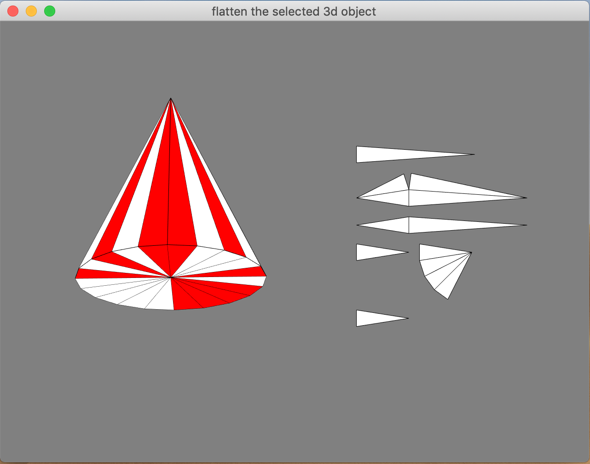

# Assignment 4: Final Project

## Application functionality:
Given a 3D model consists of triangle mesh in OFF format, output its paper model. It is able to export the paper model in SVG format and demonstrate the process of restoring the paper model to the 3D model.

## Screenshots:

### 1. Flatten

### 2. Customized Flattening Area

### 3. Restore Animation

### 4. Two sub-window Two camera

## Contorl:
- NUMBER KEY 1: Import customized input OFF file from path "*./data/input.off*".
- NUMBER KEY 2-6: Import a cube/cone/ball/fox/bunny.
- NUMBER KEY 0: Export SVG to path "*./build/export.svg*".
- SPACE: Play restore animation.
- UP/DOWN/LEFT/RIGHT: Control camera
- Mouse left click: Select mesh / select sub-window.

## Implementation details:

### 1. Flatten Algorithm
While flattening the 3D model, I am working on minimizing the perimeter(yellow lines) of the paper model so that the user can cut as less as possible.

- **Maximum spanning forest(Prime algorithm)**

    

    For the purpose of maximizing the internal edges(red lines), used Prime spanning tree algorithm to compute a maximum spanning forest of a graph *G* which construct from the given 3D model. Vertices of *G* are faces of the 3D model. If two faces are adjacent, they create an edge in graph *G*, and the weight of this edge is the length of their shared edge of the 3D model.

    Starts from a unflattened face, let it be the root of a subtree. Keep adding new faces into this subtree according prime algorithm until no more unflattened faces can be added into this subtree due to the overlap restriction.

Once all the faces have been flattened down, this flatten algorithm finished.

### 2. Overlap detection:
While flattening a mesh of the 3D model, we have to check whether the it will overlap will the current flattened meshes or not. For fastening this detection process, I employed the regular grid spatial data structure.

- **Regular grid spatial data structure**

    Given a flattened mesh *M*, with this data structure, we could quickly find out all near meshes by looking up all the grid cells which *M* touches, then pull out all the flattened meshes which associated to those grid cells.

    For simplifying this process, I look up all the grid cells which the bounding box of *M* touches.

    

- **Checking routine**

    After obtaining the near meshes set *N* of *M*, we do the followings to test whether *M* overlap with any mesh in *N*.
    
    Given *M* and near meshes set *N*. *M* has overlap with others if one of the following conditions is true.
    1. The new flatted vertex is inside a flatted mesh *T* in *N* ?
    2. Any flatted vertex of meshes in *N* is inside *M* ?
    3. The two new lines created by adding the new flatted vertex intersect with any lines of meshes in *N* ?

### 3. The layout of islands(subtree) on paper
This is a rectangle placement problem, here I employed a simple approach to arrange all the islands on the paper with limited space optimization.

Set paper width to the max width of islands, placing the islands from left to right, top to bottom.

### 4. customized flattening area
It is able to select specified parts of the 3D model to flatten. The selected meshes can be contiguous or separated.

### 5. SVG export
I provided a way to export the paper model in SVG format, so users could continue modify the paper model in a SVG and print it out.

### 6. Animation
Considering that users may feel confused about restoring the 3D model from a paper model, this application provides demonstrating animation of restoring the 3D model.

- **Algorithm for restoring animation**
    
    Record the flatten angle and the rotate axis of every mesh while flattening them. With this information, we could restore a mesh.

    

    1. Restore the related position of every vertex by traversing the maximum spanning forest(MSF).

    2. Every tree node(mesh) of MSF store the rotation angle, use it to construct a rotation matrix that around an rotate axis(used quaternion). Right multiply(this is important, because the rotation we computed is based on the flattened position) this rotation matrix to the accumulate matrix which represents the movement of ancestors.

    3. Compute the rotation matrix of every frame by interpolating rotation matrix.

    4. The move of a subtree root propagate to all nodes of the subtree, so that all the descendant move together will the root.

### 7. Sub-windows
Consider the convention of observing the 3D model and the paper model, here I split the window into two sub-windwos. Left for the 3D model, right for the paper model. Two windows use separated camera.
